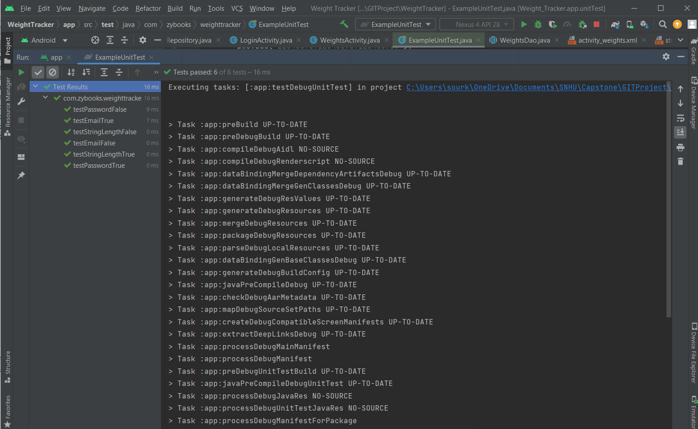
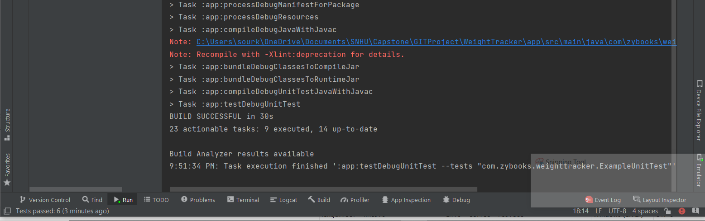
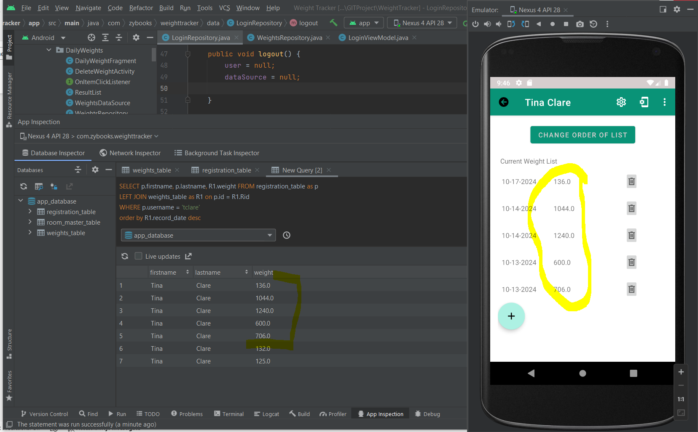

# ePortfolio
A portfolio of the Weight and See Mobile Application, developed by Laura Brooks

SNHU Capstone Project: CS499-12473-M01

10/20/2024

# Professional Assessment
### Project Summary
The Capstone course of the B.S. in Computer Science degree plan has been a fantastic way to pull together all the skills I have learned throughout the program journey. This journey started for me in early 2014 as I have been blessed to take advantage of the tuition assistance benefits at Truist Bank, where I have been employed since 2001. For this final project, I chose to enhance a mobile application I built in the CS 360: Mobile Architecture and Programming course for all three categories of the course. The application was built using the Android Studio as the IDE and the languages used are java and XML. There are two reasons behind this selection; because I find mobile development interesting and because it closely aligns with my current position and skills. Click the [Summary of the Enhancements](docs/Enhancement.md) in my online ePortfolio site on GitHub for a list of enhancements completed in the application. The setup of the ePortfolio is organized in a way that **communications to stakeholders** are housed in a unique location. The home page documents the skills and process used in the project and the sidebar includes links to supporting information.

There were several courses that I was able to fall back on to assist in the completion of the different pieces of the project. For the **Software Design and Engineering category**, the enhancement design included building a set of blueprints outlining the typical communications needed in a software development project. These documents include [user stories](docs/UseCases.md), [workflow, and flowchart diagrams](docs/WorkflowDiagram.md), and are helpful when **collaborating with a team** that includes Project Managers, Developers, Business Analysts, and Architects. Additionally, I wrote instructions on how to [view the mobile app without an emulator](docs/ExtensionInstructions.md) and documented some [before and after screenshots](docs/Screenshots.md). The Software Development Lifecycle course taught me the importance of completing development steps in accordance with industry standards. For example, I used GIT Bash source control with my GitHub repository to record commits along the project. This is a great resource to review changes made to the code at different points of the project. Click here to review the history of commits made in the project stored in GitHub. The Software Test, Automation and QA course helped in the design of some unit tests I built to test the validation functions I wrote to ensure the entered data matches the data requirements. The unit tests show passing, which gives me confidence that the validation scripts will check for data length, password, and email criteria.

For the **Algorithm and Data Structure category**, there was a bit of a learning curve switching from a static HTML page in my day job to an XML mobile style that is also subjected to screen toggles and device orientation. This means that calling methods in the correct order and using multiple threads when necessary were key to ensuring the application would not crash. I spent a considerable amount of research learning how to utilize a runnable vs. callable function to run the database calls needed to pull in the weight progress data. Once I was able to understand how to force a data call in a separate thread, I could set up a new object that would capture the data list from the database. Additionally, it was helpful to ensure all files were reorganized into folders that matched an MVC style to accommodate for the data models required. 

For the **Database category**, I used a Room Library database that uses internal storage and a SQL-Lite schema. I have several years of experience with SQL database queries and scripting, so I felt confident in showcasing some knowledge with relational databases. The original enhancement plan may have been too aggressive for the time requirements, so I downgraded to a simple two-table format with a foreign key in the weights table mapped back to the primary key in the registration table. This removed some opportunities to utilize more complex SQL query keywords like “distinct” or “group by”. The weight progress list does limit the results to 5 records and there is a button to toggle between ascending or descending order. 

'''

package com.zybooks.weighttracker.ui.login;

import com.zybooks.weighttracker.data.DAO.RegisterDao;
import com.zybooks.weighttracker.data.InitDb;
import com.zybooks.weighttracker.data.model.Register;
import java.util.ArrayList;
import java.util.List;
import java.util.concurrent.Callable;
import java.util.concurrent.ExecutorService;
import java.util.concurrent.Executors;
import java.util.concurrent.Future;

/**
 * Separate class object to run an executor function with Callable() so that the DB Query can be called
 * and a user ID can be returned to the repository object. The Callable function allows a return
 * and username/password variables are set with a constructor.
 *
 * Last updated 10/16/2024, by Laura Brooks
 *
 *
 */
public class RunOnThread {

    private final ExecutorService executorService = Executors.newSingleThreadExecutor();
    private List<Register> foundUserList = new ArrayList<>();
    private RegisterDao registerDao = InitDb.appDatabase.registerDao();
    private String username;
    private String password;
    private volatile int currentUserID = -1;

    // constructor sets the user/pwd variables
    public RunOnThread(String username, String password){
            this.username = username;
            this.password = password;

    }

    // runs the ExecutorFunction object in a Callable function on a different thread
    // a separate thread is necessary so the app is not forced closed if there is a DB error.
    public void getUserId() {
        // using a Future object to call the DB Query in executor
        Future<Integer> result = executorService.submit(new Callable<Integer>() {
            // Callable requires the call() function
            public Integer call() throws Exception {
                // the other thread - running DB Query, get user ID for return
                foundUserList = registerDao.getUserList(username, password);

                if(foundUserList.size() != 1){
                    // more than 1 user found with same username and password
                    return -1;
                } else {
                    // one user found, return ID
                    return foundUserList.get(0).getId();
                }

            }
        });
        // try/catch to get the result from the Future object or the exception
        try {
            currentUserID = result.get();
        } catch (Exception e) {
            // failed
            currentUserID = -1;
        }
        executorService.shutdown(); // shutdown executor once complete
    }

        // getter method for main activity
        public int getUser() {
            getUserId();
            return currentUserID;
        }

}

'''

In a previous course called Client/Server Development, we learned the importance of understanding the basic mechanics of the platform your application will live on and ensuring that all cylinders are firing in order and correctly on that platform. Fortunately, Android Studio has an easy-to-use debugging interface and an “App Inspection” tab that allowed me to view the internal database structure and data. In moments where the app was not functioning properly, I was able to use breakpoints to view the order of operations plus see if my data was being manipulated correctly from my CRUD methods. In the screenshot below, you can see an example of how I could write a simple query to mimic the data that displays on the activity screen. This ensures the data displayed matches the data in the database.

Utilizing all the available resources for troubleshooting is an important quality to a good developer. I have no problem reaching out to a co-worker or posting a question on a forum to find answers. Other challenges faced involved when to use an adapter file or fragment file, and how to apply the “Recycler View” to present a data list in a separate view. Although these concepts are similar in ASP.NET applications, the references are slightly different so that part had to be researched. 

Building this project helped to solidify my career goal decision in software development or engineering. I enjoyed learning the fundamentals of a mobile application and hope to apply those skills in my current and future positions. 

### Weight and See Mobile Application Summary
I chose the same artifact across all three categories, using this mobile application to produce a fully polished, quality product. Developing in Android Studio and using Java code, with an XML front end, it is remarkably similar to the ASP.NET/C# with HTML front end applications I build in my daily role. The application includes a login/registration module, an option to add a new weight to your profile, and a display of the last 5 weights entered in a dashboard. Although there were several challenges throughout the project, the biggest challenge was being mindful of each potential interaction the user could have with each screen, including device orientation. A mobile application includes a manifest file that maps out each step of the workflow and will only allow those steps to be configured in the application. Therefore, a user can only go from the login page to the weight dashboard if the manifest file decrees it. One key difference between a mobile application and a static HTML application is that each time the device is re-oriented, or a new method is introduced into the workflow, the activities “OnCreate” method is automatically run to generate the new view. This means that the app can quickly crash if certain tasks are not separated by execute threads or callable threads. In the code example below, the RunOnThread is an object created in the Main Activity but uses the ExecutorService function to run the database call which pulls the user profile ID into a variable. It returns the profile ID of the user.

# Enahancement Narratives
### Artifact Description

The artifact chosen for this project is a mobile application titled Weight and See, which was first developed in the CS 360: Mobile Architecture and Programming course. The artifact will be used for all three categories. The course was originally completed in Feb/Mar 2022 and included an initial design as well as some placeholders for extended functionality. The application was built using the Android Studio as the IDE and the languages used are java and XML. The application includes functionality to login or create an account, then displays a list of weights by date that have been entered to show progress towards a goal weight. The app uses the Room Library which functions as an Internal database utilizing SQLite. Although these enhancements will focus on the basic shell and database CRUD methods, the application was built with the intention to expand that functionality in later phases.

### Reason for Artifact Selection

This mobile app was selected for two main reasons; mobile development is an appealing career avenue, and the languages used are similar but with enough gaps to learn some new skills. The original purpose of the Weight and See app was aimed towards tracking a personal weight loss journey, however, there are other plans to reconfigure the application to use as a Material Load Weight Tracking app for a trucking hauling business. The opportunity to develop a piece of work that can be showcased, as well as reused in a realistic scenario, plus learning a new skill was highly appealing. Java and XML are very similar languages to C# and HTML, which makes a smooth transition simple. However, there is value in applying the experience I have understanding modular, object-oriented coding to learn a new style of coding. The experience made me think outside the box and look at the core structure of the application to understand where certain pieces to fit. For example, mobile applications developed in Android Studio separate style features in the resource section which encourages a relative link back to a single variable, versus absolute styles hardcoded into a CSS file. These variations are easy to pick up and was an excellent choice to begin branching out skills.

# COURSE OUTCOME ANALYSIS
*Outcome 1* - **Design, develop, and deliver professional-quality oral, written, and visual communications that are coherent, technically sound, and appropriately adapted to specific audiences and contexts.** I have completed all the deliverables as specified in the enhancement plan. Those include a workflow, a Class Diagram, User Stories with Diagram, Test Case Scenarios, and the Database Schema. Additionally, I wrote instructions on how to view the mobile app without an emulator and documented some before and after screenshots. The code includes an info comment block at the top of each page that summarizes the date of the last update, the enhancements made, and description. Each method has a short comment to describe what it is doing. All these deliverables, the comments, the instructions, and the screenshots provide evidence to support the enhancement design and plan proposed, as well as be helpful for anyone viewing the application. From developers looking for ideas, to career recruiters looking for candidates, the diverse showcase of work will satisfy needs for several roles. 

*Outcome 2* - **Employ strategies for building collaborative environments that enable diverse audiences to support organizational decision-making in the field of computer science.** As with any software development team, there are several members that each have unique roles. Although this project is designed and developed by one person, the thought process is in line with a general Software Development Lifecycle methodology to ensure all pieces of the project are capable of changing hands to another team. For example, proper commenting is shown throughout the code to describe the purpose, parameters, and any relationships to help troubleshoot any issues. All classes and methods can be found in logical order or folders to help keep the files organized.

*Outcome 3* - **Design and evaluate computing solutions that solve a given problem using algorithmic principles and computer science practices and standards appropriate to its solution while managing the trade-offs involved in design choices.** This outcome was achieved by starting with a simple design that is also useful and user-friendly. By starting with the basics, computer science principles are highlighted by using basic CRUD methods to access data elements from a single data source. More complex functionality is needed in the way of validation and security of the logon screen by using private methods, view models that run on separate threads, and clearing data fields upon resuming back to a login screen.  For example, in the Login Activity section, there are methods using a View Model scenario to ensure a secure back-end process is performed after the user has entered the username and password. These fields are checked, validated, and then run through a database search to return the user ID. The user ID needs to be securely passed to the next screen.

*Outcome 4* - **Demonstrate an ability to use well-founded and innovative techniques, skills, and tools in computing practices for the purpose of implementing computer solutions that deliver value and accomplish industry-specific goals.** The argument could be made that this course outcome is covered throughout the project. From the preparation and design work done in Software Engineering, to well-developed and organized algorithms in Algorithms and Data Structures; the Database category displays additional techniques in utilizing a relational database solution to capture data using internal storage and saving storage space. Industry standards dictate that mobile applications provide data entry and retrieval functionality so without the database the application would not be helpful. Some of the unique skills and tools used throughout the project are making use of source control through GIT Bash with GitHub repository, utilizing standard Android/Java development functions like the Recycler View and an Adapter file, and developing an ePortfolio that has sidebar navigation and searching.

*Outcome 5* - **Develop a security mindset that anticipates adversarial exploits in software architecture and designs to expose potential vulnerabilities, mitigate design flaws, and ensure privacy and enhanced security of data and resources.** The application is secured by a username and password module that displays information related to the user by accessing data via a user ID. The username and password data are kept secure in the database by developing methods that keep the data private as each function is called. Additionally, encryption of the fields is an option, but not yet applied. The use of back buttons and links are organized in a way that will not allow a user to navigate to a screen without accessing the login page first.

# ENHANCEMENT PROCESS REFLECTION
### Category One: Software Design & Engineering

Since the same artifact will be used throughout the course for all categories, the enhancement progress is intertwined between all 3 categories of the course. For example, design documents have been developed to support the Software Development Life Cycle, database functionality has been added, colors are considered, and code functions that can be modular or reusable are favored. All these tasks contribute to a software design/engineering category. Strategic and critical thinking is involved to re-engineer an existing application that will build on stale functionality. I am confident in the structure I created to make the application organized and easy to follow.  By creating meaningful classes with appropriate arguments that will be called throughout the project securely and efficiently shows evidence of being able to structure an application in a logical way that is transferrable to other developers. I am confident in my abilities to analyze code for potential security risks. I created some validation functions and unit tests to ensure the entered data matches the requirements and checks for SQL injection. Additionally, any arguments passed need to be done in a way that will not allow vulnerabilities. For example, when passing the User ID from screen to screen, the code includes checks for potential hacking risks. If someone can update a user ID in the backend code, like a query string or hidden field, it will allow any user to change the ID to any account. This field is secure and private. 
Along the development path, challenges were encountered. It was important to use the resources available to me to troubleshoot problem code or research a function that I am not familiar with. This occurred often when learning how to apply the Room Library database code to my methods. I have a comfortable confidence in my ability to build ASP.NET MVC applications with a SQL Database back-end. This knowledge was helpful when applying database functionality to mobile applications in Java. After many years of experience growing in the software development field, knowing how to apply problem solving skills to the tricky nuisances is paramount. For example, when I have a piece of code that is not working, I will comment out everything and add code in line by line until I understand the issue. As I was working through the enhancements, I had some PC slowness issues that required me to re-evaluate the proposed requirements. Providing realistic deadlines and then re-assessing along the way are characteristics I have learned to develop with experience. One of my better strengths is being able to size a project with the amount of work needed within the deadline available, while also setting realistic expectations of the final product. By reducing the number of enhancements in my initial project proposal, I will be able to deliver a clean, workable solution that still showcases my skills as a software developer.  

### Category Two: Algorithms and Data Sets

Once the design preparations are completed and the basic shell is created, focus is now geared towards writing code that uses the full capability of the Java language and algorithmic practices. Screens are represented as a single class, with breakout for more complex functionality to use fragment classes or view models. This helps keep the code catalogued while also taking advantage of any opportunity to use modularized functions. For example, regarding validation, functions that verify data types and size are reusable throughout the screens. These functions also include unit tests to ensure the integrity of the data is accurate. I made use of looping or conditional statements whenever possible, particularly when checking database results. Another example of this is the use of a switch statement to run different menu options based on the selection made on that screen. Arrays and looping are required to display a list of recordset results from the database. Efficiency is gained during the login process by creating an object using a custom “RunOnThread” class. This class will check if the username password combination passed matches an existing entry and returns the profile record. The class is also used in other areas to pull the profile first and last name to display on the dashboard. I made use of a Recycler View that works with the recordset of weight objects returned by the user ID. The recycler view will run through the position of each object returned and display the data is an adapter file.
Some challenges related to this category include the use of an “Intent” action and passing an argument between screens. The Intent action is the Java/Mobile application version of switching views and it is not a topic that I am familiar with. Along with the Intent action, Java provides an ability to add extra values to the Instance state. Setting and retrieving these values have been somewhat difficult because they must be done at the correct thread level. I worked through some debugging exercises to figure out when the values were being set, when they were dropped, and locating the appropriate error. I am more familiar with query strings and being able to view those values in a browser tool. Mobile Applications do not operate the same way so there was a learning curve in this area.

### Category Three: Databases

The database enhancement included adding a back-end database solution from the ground up. There was no existing database in the original, starting version of the application. The Room Library solution could be added to the existing application which uses a SQL-Lite style that runs internally so no additional or external servers were required. I began by creating some model files that will generate the database columns and set or get the values of a record set. Database Access Object (DAO) files are used to store and recall any SQL queries written to pull the data. The layout of the database can be easily scaled up in scenarios where further enhancements are applied. Files for data models were written to store the data schema of each table. Understanding the datatypes of a database and how each value is best stored is important in the initial design because it helps keep changes to a minimum.
Although the database solution is setup in a way that matches my experience and skills, there were some key challenges when attempting to write functional algorithms and methods to connect the data to user entries and dashboards. This mobile application style uses View Models, which is common in modular style applications, but there were some new functions to learn such as Recycler Views and Fragment sections. These functions are basically a different way of calling a small set of data into a frameset of the screen, but the setup is a new concept that I had to research. The learning curve is related to getting the list object pulled from a database to display in a Recycler View in XML format. This is different from an HTML based MVC project where razor code can be applied to the view.

